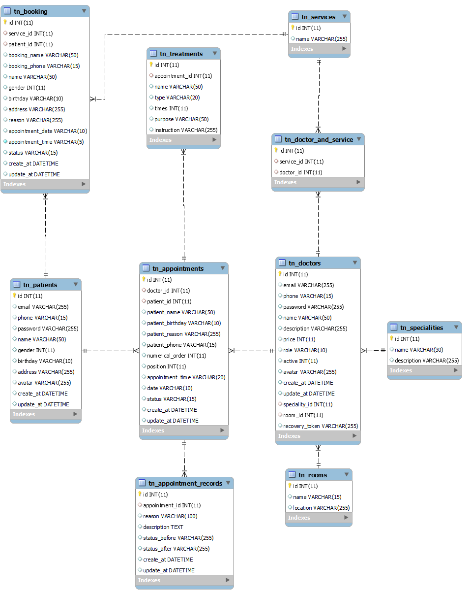
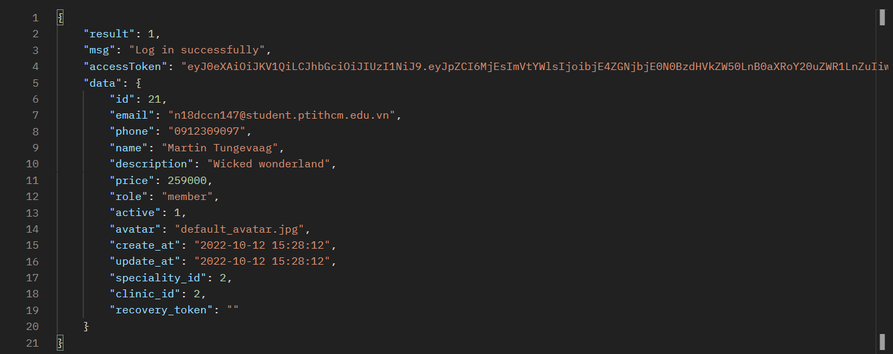
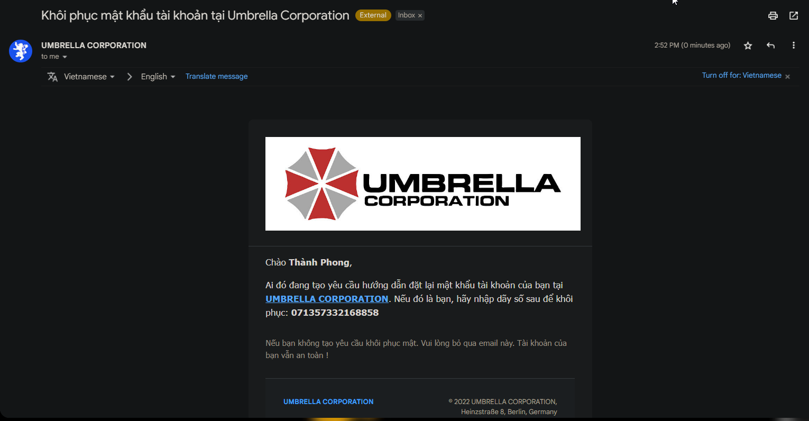
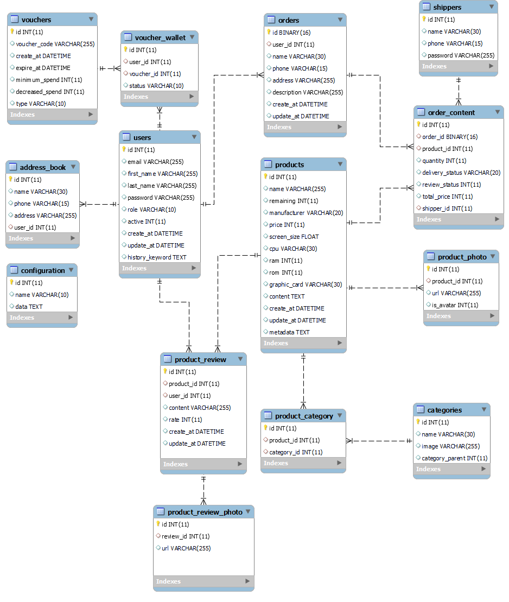

<h1 align="center">Đồ án tốt nghiệp - Học viện Công nghệ Bưu chính viễn thông  
    Ứng dụng Android hỗ trợ bệnh nhân đăng ký khám và điều trị bệnh 
</h1>

    

# [**Table Of Content**](#table-of-content)
- [**Table Of Content**](#table-of-content)
- [**Introduction**](#introduction)
- [**Topic**](#topic)
- [**API Document**](#api-document)
- [**Database**](#database)
- [**Document**](#document)
- [**Features**](#features)
  - [**1. Login**](#1-login)
  - [**2. Sign Up**](#2-sign-up)
  - [**3. Recovery Password**](#3-recovery-password)
- [**Milestone**](#milestone)
- [**Post Script**](#post-script)
    - [**05-10-2022**](#05-10-2022)
    - [**20-10-2022**](#20-10-2022)
- [**Bonus**](#bonus)
- [**Timeline**](#timeline)
  - [**Phase 0: 01-09-2022 to 28-09-2022**](#phase-0-01-09-2022-to-28-09-2022)
  - [**Phase 1: 19-09-2022 to 25-10-2022**](#phase-1-19-09-2022-to-25-10-2022)
  - [**Phase 2: 26-10-2022 to xx-11-2022**](#phase-2-26-10-2022-to-xx-11-2022)
- [**Controller Timeline**](#controller-timeline)
- [**Special Thanks**](#special-thanks)
- [**Made with 💘 and PHP **](#made-with--and-php-)

# [**Introduction**](#introduction)

Chào các bạn, mình tên là Nguyễn Thành Phong. 
Mã số N18DCCN147. 
Niên khóa 2018-2023. 

Lời đầu tiên mình xin chào các bạn và cảm ơn tất cả các bạn đang ở đây. Trong tài liệu này mình sẽ chia sẻ tất cả những gì các bạn cần biết khi làm đồ án 
tốt nghiệp và đề tài do mình thực hiện để các bạn có thể tham khảo. Mình hi vọng phần tài liệu mình viết tiếp theo đây 
sẽ hỗ trợ phần nào cho các bạn khi bước tới ngưỡng cửa quan trọng của cuộc đời mình - tốt nghiệp đại học.

# [**Topic**](#topic)

    

Có thể giải thích yêu cầu đề tài ngắn gọn như sau:

**Website** - Đóng vai trò là ứng dụng quản trị viên. Hỗ trợ bệnh viện quản lý thông tin bác sĩ & bệnh nhân,
sắp xếp lịch khám bệnh giữa bác sĩ và bệnh nhân.

**Android** - Ứng dụng để bệnh nhân đặt lịch khám bệnh, theo dõi phác đồ điều trị và bệnh án của mình. Có thể đặt lịch khám bệnh
cho người thân trong gia đình như ông, bà, bố, mẹ & không nhất thiết người khám bệnh phải là bản thân mình.

# [**API Document**](#api-document)

Mình có soạn thảo và liệt kê chi tiết cách sử dụng các chức năng mà mình đã xây dựng thành tài liệu.
Nếu các bạn có nhu cầu muốn tham khảo, hãy ấn vào [**đây**](https://github.com/Phong-Kaster/PTIT-Do-An-Tot-Nghiep/tree/main/document#readme) để đọc chi tiết cách sử dụng API này.

# [**Database**](#database)

    

<h3 align="center">

***Sơ đồ cơ sở dữ liệu***
</h3>

Tớ sẽ giải thích qua về ý nghĩa các bảng xuất hiện trong database nha

**BẢNG PATIENTS** - bảng này chứa thông tin của bệnh nhân.

**BẢNG BOOKING** - bảng này chứa các lịch hẹn mà bệnh nhân đăng ký khám bệnh.

**BẢNG APPOINTMENTS** - bảng này chứa lịch hẹn thực tế với bác sĩ. Bảng Booking mới chỉ là cuộc hẹn của bệnh 
nhân & họ hoàn toàn có thể hủy lịch hẹn. Nhưng bản Appointment thì sẽ lưu thứ tự khám thực tế của các bệnh nhân với số thứ tự.

**BẢNG TREATMENTS** - bảng này chứa phác đồ điều trị sau khi đã khám xong. Phác đồ điều trị là hướng
dẫn mà bệnh nhân phải tuân thủ như: lịch uống thuốc, lịch tái khám,.....

**BẢNG APPOINTMENTS RECORDS** - lưu trữ bệnh án của bệnh nhân. Mỗi bệnh án đi kèm với một lịch khám thực tế ( tức appointment )

**BẢNG DOCTORS** - lưu trữ thông tin của các bác sĩ.

**BẢNG SPECIALITIES** - bảng này thể hiện tên chuyên khoa của bác sĩ. Ví dụ: Nội khoa, Răng - hàm - mặt,..

**BẢNG NOTIFICATIONS** - mỗi khi một lịch khám thực tế được thực hiện với bác sĩ. Bảng này sẽ chứa thông báo cho bác sĩ đó. 

**BẢNG SERVICES** - chứa tên các dịch vụ mà ứng dụng hỗ trợ. Ví dụ: Khám sức khỏe tổng quát,
khám thai, xét nghiệm PCR COVID-19,...

**BẢNG DOCTOR AND SERVICE** - thể hiện mối quan hệ một nhiều. Khi một bác sĩ có thể phục vụ nhiều 
loại hình dịch vụ khác nhau. Ví dụ, một bác sĩ chuyên khoa Nội tổng hợp thì vẫn có thể khám về Da liệu.

# [**Document**](#document)

Khi tải repository này về, bạn sẽ thấy một thư mục tên `document`. Trong thư mục này, mình 
để lại cho các bạn một số tài liệu quan trọng

- **Danh-sach-de-tai-tot-nghiep** - là tệp tin excel tổng hợp lại toàn bộ các đề tài của từng sinh khóa D18

- **Tập hợp các tệp tin có tiền tố eshop** - là database mình mở rộng ra từ đồ án thực tập( Rất tiếc là không có cơ hội sử dụng 😥)

- **Noi-dung-quyen-bao-cao** - là các yêu cầu chung để làm báo cáo tốt nghiệp. Tuy nhiên thì tệp tin này do thầy **Nguyễn Anh Hào** soạn 
và gửi cho các sinh viên thầy hướng dẫn. Không biết các giáo viên khác có gửi không nữa😅😅

- **README.md** - là một tệp tin markdown khác, mình tạo ra nó để mô tả cách đọc và sử dụng API do mình viết.

# [**Features**](#features)

Phần này mình sẽ liệt kê các tính năng chính và quan trọng mà API này có thể thực hiện.

## [**1. Login**](#login)

Đầu tiên dĩ nhiên luôn là tính năng đăng nhập rồi. Với tính năng cơ bản nhất và quan trọng này thì mình vẫn sử dụng JWT Token như ở 
[**Đồ án thực tập**](https://github.com/Phong-Kaster/PTIT-Do-An-Thuc-Tap). Còn các thông tin còn lại thì có bao nhiêu thì in ra hết( Dĩ nhiên là trừ cái mật khẩu rồi 😅😅).

    

<h3 align="center">

***Dữ liệu trả về khi đăng nhập thành công***
</h3>

## [**2. Sign Up**](#2-sign-up)

Có đăng nhập thì dĩ nhiên là phải có đăng ký rồi. Tính năng này thì chẳng có gì lạ lẫm với các bạn cả. Ngoài các thông tin người dùng nhập vào và sau khi kiểm tra hợp lệ
thì họ sẽ được nhận một email thông báo gửi tới email mà được sử dụng để tài khoản như sau:

    

<h3 align="center">

**Chúc mừng bạn đã trở thành thành viên của tập đoàn Umbrella Corporation 🎇**
</h3>

## [**3. Recovery Password**](#3-recovery-password)

Bạn bị bệnh não cá vàng 🐠🐠? Bạn hay làm trước quên sau ? Lần này thì quên cmn luôn mật khẩu mình vừa mới tạo. 
Đừng lo ! API này hỗ trợ luôn trường hợp bạn quên mật khẩu. Chỉ cần nhập đúng email bạn đã đăng kí tài khoản tại **UMBRELLA CORPORATION** 

BÙM 🔥🔥🔥 Ngạc nhiên chưa !! Nhập cái mã bên dưới và tạo lại mật khẩu nào 

    

<h3 align="center">

**Lần sau đừng quên mật khẩu nữa nha 😅😅**
</h3>

# [**Milestone**](#milestone)

Phần này mình ghi lại những mốc thời gian quan trọng mà mình đã trải qua trong quá trình làm đồ án. 
Những mốc thời gian dưới đây là của mình & có thể khi các bạn đọc thì các mốc thời gian sẽ khác đi 3-4 ngày. 
Tuy nhiên, Napoleon đã từng nói: 

    

<h3 align="center">

***"90% sự thành bại của một trận đánh phụ thuộc vào thông tin" - Napoleon***
</h3>

Đối với mình thì câu nói trên chưa bao giờ lại đúng đến vậy. Trong 4 năm rưỡi mài đít quần trên giảng đường,
mình thấy cực kì thiệt thòi vì không ở kí túc xá hoặc ở gần trường học. Trước mỗi kì thi, những sinh viên 
ở kí túc xá thường sẽ biết rất nhiều những thông tin có giá trị trước mỗi kì thi😫😫. Rất nhiều lần do mình không
biết thông tin sớm hơn mà dẫn tới thiệt thòi so với bạn bè. 

Ví dụ: sau kì thi môn Lập trình mạng ở năm 4, thầy Phan Thanh Hy cho phép sinh viên được quyền khiếu nại nếu bị 
điểm thấp do là ông thầy này thường lười & để sinh viên năm 2-3 chấm bài thi cuối kì của lớp mình. Điều này 
dẫn tới hậu quả là nhiều bạn bị điểm thấp hơn so với mong muốn. Và để sửa sai, thầy cho phép sinh viên được quyền khiếu nại về 
điểm số. Thường thì ông thầy sẽ kiểm tra kĩ 1-2 đứa đầu tiên khiếu nại, còn tất cả những sinh viên sau 
đó khiếu nại thì auto là được nâng lên 1-2 điểm. Là đứa ở xa trường, dĩ nhiên là mình biết thông tin 
này quá muộn và không kịp thời gian để khiếu nại rồi.😀 Chán vl!

Lòng vòng như vậy là đủ rồi. Ví dụ bên trên mình chỉ muốn nói là rất nhiều môn thi có thể dễ thở hơn
nếu biết trước được đề thi - thường đề thi hàng năm không bao giờ đổi cả. Nếu có đổi thì chỉ đổi mỗi số thôi, các thầy cô cũng lười đổi đề lắm.😏

Giờ chúng ta sẽ đi vào các mốc thời gian quan trọng mà mình đã trải qua nha

- **28-09-2022**: Công bố danh sách giao nhiệm vụ đề tài & kết quả việc nộp đơn chuyển từ làm Đồ án tốt nghiệp sang học Môn thay thế.

- **01-10-2022**: Sinh viên được liên hệ với giáo viên hướng dẫn để hiệu chỉnh, bổ sung nội dung đề tài đồ án tốt nghiệp đến ngày 01/10/2022.

- **11-10-2022**: Nhà trường công bố lại danh sách giao đồ án tốt nghiệp Đại Học Chính Quy khóa 2018-2023

- **26-10-2022**: Nộp báo cáo đồ án tốt nghiệp lần 1

- **11-11-2022**: Nộp báo cáo đồ án tốt nghiệp lần 2

- **30-11-2022**: Nộp báo cáo đồ án tốt nghiệp lần 3

- **09-12-2022**: Nộp đồ án tốt nghiệp

> Quy tắc đặt tên áp dụng cho cả 3 lần - Lớp (mã chữ)_Mã sinh viên(3 số cuối)_Họ và tên _BCDK1
> 
> VD: CP_147_NguyenThanhPhong_BCĐK1
>
> Lưu ý: đặt tên file giống hướng dẫn, đặt sai sẽ bị thống kê không nộp báo cáo định kỳ, cấm nộp cuốn báo cáo cuối kỳ.
# [**Post Script**](#post-script)

### [**05-10-2022**](#)

Mình không muốn miệt thị chính mái trường mình đã theo học nhưng thực sự là nhiều cái nó như lìn 😋😋. 
Các bạn cứ đọc tấm ảnh phía dưới là sẽ hiểu.

    

<h3 align="center">

***Minh chứng cho sự hãm lìn của trường PTIT***
</h3>

Ban đầu mình không định học làm đồ án tốt nghiệp vì đơn giản là làm đồ án thì khó, mệt và rất áp lực. Học thay thế thì nhẹ nhàng hơn.
Quan trọng hơn cả là kết quả cuối cùng thì mình sẽ vẫn ra trường và xếp loại tốt nghiệp không bị thay đổi. Tức là nếu bạn đạt học lực GIỎI
thì dù bạn học thay thế để ra trường thì nó vẫn là bằng GIỎI.

Vậy mà đùng một cái, nhà trường **từ chối hết tất cả đơn xin chuyển từ đồ án sang học thay thế** 🙂🙂🙂 ( cái dm trường, thế thì ngay từ đầu nói vậy đi cho rồi. Để sinh viên nộp 
đơn cho sướng vào rồi cuối cùng vẫn bắt sinh viên làm đồ án tốt nghiệp). Thực sự là mình cay không thể tả nổi.

Mình đã đánh đổi bằng việc kết thúc sớm chương trình thực tập tại GeoComply ngày 03/10/2022 để đánh đổi bằng việc học thay thế cho khỏe thân.
 Ai dè giờ vẫn phải làm đồ án tốt nghiệp. Chán thực sự chán 😣😣

### [**20-10-2022**](#)

Chúc mừng ngày Phụ nữ Việt Nam 2022 

Yeah, hôm qua là lần cuối cùng mình nộp tiền học phí cho trường 😂😁😂. Thế là hết nợ rồi.

Nếu chỉ vậy thì mình sẽ không viết những dòng này. Trường mình có một hệ thống làm việc rất quan liêu và hết sức vớ vẩn.
Làm đồ án tốt nghiệp hay học môn thay thế các bạn đều **PHẢI ĐÓNG HỌC PHÍ** với niên khóa của mình - 2018-2023 - thì số tiền là 
**3.300.000 đồng**. Tuy nhiên đó chưa phải là điều mình bức xúc nhất. 

Điều bức xúc ở đây là sự quan liệu tới mức vô tổ chức. Nhà trường không hề viết một công văn, một thông báo chính thức gì để gửi tới
sinh viên cả 😤😤😤😤😤( điên máu thực sự). Rất may mắn là bạn lớp trưởng lớp mình chủ động hỏi phòng tài chính về thời hạn đóng 
học phí thì....

**ỐI GIỜI ƠI ! Hạn đóng học phí là từ ngày 14-10-2022 đến ngày 19-10-2022** nhưng tụi mình chỉ mới nắm thông tin ngày 18-10-2022.
Chán thực sự chán luôn ạ. Làm ăn vớ va vớ vẩn.

Nếu học phí của đồ án( hoặc học thay thế) không nộp đúng hạn thì nhà trường sẽ **cho rằng chúng ta tự ý bỏ học và hủy toàn bộ kết 
quả học tập trong suốt 4 năm vừa qua**. 

Việc hủy kết quả học tập tưởng chừng chỉ là đòn hù của nhà trường nhưng không nha các bạn. Tớ
đã chứng kiến việc nộp học phí muộn mà kết quả học tập 1 học kì bị hủy và bạn đó phải học lại những môn của kì đó rồi. Do vậy dĩ nhiên 
là nộp chậm học phí cho đồ án ( học môn thay thế ) không phải là một lời đe dọa ạ. Méo hiểu sao tiền thì thu nhanh và không bớt 
một đồng nhưng việc giải nhân tiền học bổng và sửa chữa cơ sở vật chất thì.... Nói chung là chán lắm, không muốn nói nữa🥱🥱🥱🥱

# [**Bonus**](#bonus)

Dưới đây là cơ sở dữ liệu mà mình phát triển lên từ Đồ án thực tập. Cơ sở dữ liệu này mình thiết kế từ trước phải làm đề tài.
Sau đó thì thay đổi suy nghĩ để chuyển qua làm học thay thế tốt nghiệp.

    

<h3 align="center">

# [**Timeline**](#timeline)

## [**Phase 0: 01-09-2022 to 28-09-2022**](#phase-0-01-09-2022-to-28-09-2022)

- **04-09-2022**: Thi vấn đáp với giáo viên hướng dẫn về đồ án thực tập

- **09-09-2022**: Thi vấn đáp với giáo viên phản biện về đồ án thực tập 

- Thời gian còn lại: đi làm và xả hơi sau thời gian dài làm đồ án thực tập căng thẳng.

## [**Phase 1: 19-09-2022 to 25-10-2022**](#phase-1-19-09-2022-to-25-10-2022)

(1) Mục tiêu: Giai đoạn này xây dựng RestfulAPI - là linh hồn của toàn bộ đồ án này.

(2) Uớc tính: 14 ngày 

(3) Thực tế: Bắt đầu ngày 04-10-2022 & kết thúc ngày 27-10-2022. Suy ra, mất 22 ngày để hoàn thiện. 
Trong đó có một tuần mình chưa làm gì bởi vấn đề tâm lý sau khi nghỉ việc

- **19-09-2022**: Thiết kế cơ sở dữ liệu với nhiều bảng nhằm triển khai các chức năng phức tạp hơn

- **04-10-2022**: Thiết kế cơ sở dữ liệu theo đề tài nhà trường giao.

- **05-10-2022**: Tối ưu cơ sở dữ liệu và tìm hiểu kĩ các trường hợp đặc biệt của đề tài.

- **06-10-2022 -> 09-10-2022**: Làm một số việc vặt và chủ yếu là ăn chơi, nghỉ việc thấy hụt hẫng quá, hic hic 😥

- **10-10-2022**: 

1. Xây dựng chương trình để viết API

2. Chức năng đăng nhập cho bác sĩ 

3. Specialities Controller & Speciality Controller - Đọc thông tin tất cả các chuyên khoa

4. Nghiên cứu cách gửi email với PHP Mailer.

- **11-10-2022**:

1. Hoàn thiện tính năng gửi email khi có tài khoản mới đăng kí - Sign Up Controller 

2. Hoàn thiện tính năng khôi phục mật khẩu với mã xác thực được gửi qua email - Recovery Controller & Password Reset Controller

- **12-10-2022**:

1. Hoàn thiện tính năng quản lí các địa chỉ phòng khám - Clinics Controller & Clinic Controller

2. Đọc toàn bộ thông tin các bác sĩ và tạo tài khoản mới với mật khẩu được gửi về bằng Email - Doctors Controller 

3. Đọc thông tin chi tiết của một bác sĩ - Read của Doctor Controller.

- **13-10-2022**:

1. Hoàn thiện tính năng thêm - sửa - xóa thông tin bác sĩ - Create Update Delete của Doctor Controller. 

2. Khai báo đầu đủ toàn bộ các model của đồ án.

3. Sửa lại phần Login Controller để xử lý đăng nhập của bệnh nhân bằng OTP gửi tới số điện thoại.

- **14-10-2022**:

1. Các chức năng cập nhật thông tin cá nhân, mật khẩu và ảnh đại diện dành cho bác sĩ - Doctor Profile Controller

2. Quản lý thông tin bệnh nhân

| Tên        | Chức năng                                                                         |
|------------|-----------------------------------------------------------------------------------|
| Read All   | Xem toàn bộ thông tin bệnh nhân                                                   |
| Read By ID | Cập nhật thông tin của 1 bệnh nhân                                                |
| Create     | Không làm vì bệnh nhân đăng nhập bằng PHONE NUMBER và GOOGLE                      |
| Update     | Cập nhật thông tin của 1 bệnh nhân                                                |
| Delete     | Không làm vì có thể đem thông tin bệnh nhân đi bán kiếm tiền 🤑🤑🤑. Kiếm tiền là dễ |

- **15-10-2022**:

1. Sửa lại chỗ tạo JWT token để phân biệt yêu cầu đăng nhập giữa BÁC SĨ và BỆNH NHÂN.

2. Các chức năng cập nhật thông tin cá nhân, mật khẩu và ảnh đại diện dành cho bệnh nhân - Patient Profile Controller

- **16-10-2022**: Chủ nhật rồi, gác lại âu lo thôi 🎉

- **17-10-2022**:

1. Viết báo cáo phân tích đề tài và mô tả các use-case 

2. Thiết kế và mở rộng database 

3. Mô hiệu hóa bảng Clinic( phòng khám ) vì đây là ứng dụng dành cho một phòng khám độc lập.

4. Tạo mới Service Model và Controller tương ứng.

- **18-10-2022**:

1. Quản lý các dịch vụ mà một bác sĩ hỗ trợ - Doctors And Services Controller 

2. Chức năng tạo lịch khám bệnh cho phía bênh nhân - Patient Booking Controller - kiểm 
tra dữ liệu đầu vào lâu vl, nhất là thời gian đặt lịch khám.

- **19-10-2022**:

1. Viết tài liệu API phần Authentication và Patients

- **20-10-2022**:

1. Thêm Patient Booking Controller để hỗ trợ bệnh nhân xem chi tiết một booking, hỗ trợ hủy booking.

2. Quản lý các Booking cho bác sĩ vai trò ADMIN và SUPPORTER

| Tên        | Chức năng                                                                                                                                                           |
|------------|---------------------------------------------------------------------------------------------------------------------------------------------------------------------|
| Read All   | Xem toàn bộ thông tin các lịch hẹn                                                                                                                                  |
| Read By ID | Đọc thông tin chi tiết của 1 lịch hẹn                                                                                                                               |
| Create     | Tạo mới 1 lịch hẹn nhưng KHÔNG KHUYẾN KHÍCH. Thay vào đó tạo thẳng lịch khám bệnh luôn                                                                              |
| Update     | Thay đổi thông tin của 1 lịch hẹn với điều kiện trạng thái phải là processing                                                                                       |
| Confirm    | Trả lời lịch hẹn của bệnh nhân. Nếu CANCELLED thì cập nhật trạng thái, nếu VERIFIED thì ngoài cập nhật trạng thái sẽ tiến hành tạo mới lịch khám bệnh(appointment)  |

3. Sửa lý phần đặt lịch hẹn cho bệnh nhân.

Tóm tắt:

- **Trường hợp 1** - khách vãng lai không đặt lịch qua Android thì ngày khám mặc định là ngày hôm nay & lấy số thứ tự luôn.

- **Trường hợp 2** - khách đặt qua Android thì ngày khám sẽ là ngày được đặt trong Android và sẽ KHÔNG ĐƯỢC lấy số thự ngay. Chỉ khi họ 
xuất hiện ở bệnh viện thì mới có số thứ tự.

- **21-10-2022**:

1. Viết tài liệu cho API Patient Profile 

2. Viết tài liệu cho API Patient Booking

3. Các chức năng chỉnh sửa cho lịch khám bệnh (appointment) - Appoitment Controller

- **22-10-2022**

1. Viết chức năng quản lý phác đồ điều trị và chỉnh sửa thông tin - Treatments Controller và Treatment Controller
Các đơn thuốc hay hướng dẫn này chỉ được thay đổi khi appointment đang là PROCESSING.

- **23-10-2022**

1. Viết chức năng quản lý bệnh án cho mỗi lịch khám - Appointment Records và Appointment Record.

- **24-10-2022**

1. Tách riêng lịch khám bệnh từ BOOKING và NORMAL thành 2 nhánh riêng biệt.

2. Tạo Appointment Queue để truy vấn các appointment với các thông tin tối giản - Appoitment Queue Controller

3. Tạo Appointment Queue Now để lấy danh sách khám bệnh hiện tại cho cả BOOKING và NORMAL. - Appointment Queue Now Controller

4. Quản lý phòng khám để xác định vị trí bác sĩ làm việc - Rooms Controller và Room Controller.

- **25-10-2022**

1. Viết báo cáo định kì lần 1

## [**Phase 2: 26-10-2022 to xx-11-2022**](#phase-2-26-10-2022-to-xx-11-2022)

- **26-10-2022**

1. Hoàn thiện báo cáo định kì lần 1 và nộp 

2. Tìm kiếm Front-end template cho Admin

3. Gộp website và api vào chung một dự án này, bao gồm:

| Tên        | Chức năng                               |
|------------|-----------------------------------------|
|Thư mục API |Chứa toàn bộ các RestfulAPI của đồ án này|
|Thư mục Website| Chứa website quản lý dành cho bác sĩ |

4. Dựng giao diện màn hình đăng nhập 

- **27-10-2022**:

1. Dựng giao diện cho chức năng đăng ký 

2. Dựng giao diện cho chức năng đăng nhập

3. Dựng giao diện chưa qua xử lý cho dashboard

- **28-10-2022**:

1. Tách các thành phần cho dashboard và các trang web còn lại

2. Dựng thanh điều hướng bên trái 

3. Dựng thanh điều hướng bên trên

- **29-10-2022**: 
  
1. Dựng xong nội dung trang dashboard.
   
2. Viết chart controller để tạo ra 2 biểu đồ cho dashboard

- **30-10-2022**: Chủ nhật rồi, gác lại âu lo thôi 

- **31-10-2022**:

1. Sửa lại câu truy vấn cho Charts Controller lấy đúng số lượt khám trong 7 ngày gần nhất. 
Tính từ ngày hôm nay

2. Sửa lại luồng xử lý xếp lịch hẹn giống với gợi ý thầy Hào. 

Tức đặt lịch hẹn chỉ là hình thức để bác sĩ biết trước bệnh án và ưu tiên cho những bệnh 
nhân bị các bệnh đặc biệt mà không thể đợi lâu. Chúng ta sẽ không phát số thứ tự 
cho những bệnh nhân BOOKING.

Thay vào đó, họ tới bệnh viện thì mới bắt đầu phát số. Nếu họ bị bệnh đặc biệt, ví dụ: bệnh trĩ.... hoặc người 
bệnh đã đặt thời gian vào khám thích hợp thì HỖ TRỢ VIÊN sẽ tiến hành sắp xếp thứ tự khám cho họ

3. Chỉnh sửa phần top navigation để hiển thị đúng thông tin

4. Xây dựng giao diện THỨ TỰ LỊCH KHÁM

5. Đổ dữ liệu vào bảng THỨ TỰ LỊCH KHÁM

- **01-11-2022**:

1. Xử lý jQuery các nút chức năng trong THỨ TỰ LỊCH KHÁM

2. Đổ dữ liệu vào các bộ lọc tìm kiếm trong THỨ TỰ LỊCH KHÁM

3. Sửa lại chức năng getAll() trong Appointments Controller để nhiều chi tiết dữ liệu hơn

- **02-11-2022**:

1. Hàm get All của Specialities | Doctors | Appointments Controller giờ sẽ được truy cập bởi 
tất cả bác sĩ ADMIN | SUPPORTER | MEMBER.

2. Trong phần quản lý THỨ TỰ KHÁM BỆNH

Nếu trạng thái lịch khám bệnh là PROCESSING thì hiển thị đủ 3 nút XONG | HỦY | XÓA
Nếu trạng thía lịch khám bệnh không là PROCESSING  thì ẩn 3 nút chức năng XONG | HỦY | XÓA

    

Nếu bác sĩ đang nhập là MEMBER thì nút KHÁC sẽ có BỆNH ÁN và PHÁC ĐỒ ĐIỀU TRỊ.
Nếu bác sĩ không là MEMBER thì nút KHÁC sẽ chỉ có CHI TIẾT và SỬA.

    

3. Chỉnh lại bộ câu lệnh SQL script version 4 và thêm một số dữ liệu mẫu để khi copy vào là có thể chạy được luôn. 

- **03-11-2022**:

1. Viết xong phần phân trang cho website bằng Javascript kết hợp JQuery(trước giờ chưa bao giờ làm kĩ 
phần này nên mất nhiều thời gian quá)

2. Dựng giao diện cho việc thêm và chỉnh sửa THỨ TỰ LỊCH KHÁM

- **04-11-2022**:

1. Chỉnh sửa giao diện cho 2 nút XÁC NHẬN và HỦY BỎ trong phần chỉnh sửa THỨ TỰ LỊCH KHÁM 

2. Viết jQuery xử lý sự kiện

3. Hoàn thành việc xử lý thêm & sửa thông tin lịch hẹn

4. Dựng giao diện phần sắp xếp thứ tự lịch khám

- **05-11-2022**:

1. Hoàn thiện chức năng sắp xếp lịch thứ tự khám.

2. Xem - xóa - lọc dữ liệu với LỊCH HẸN khám bệnh.

- **06-11-2022**:

1. Hoàn thiện phân trang | chức năng hủy  tạo thứ tự khám từ lịch hẹn | sửa thông tin LỊCH HẸN.

2. Chức năng sắp xếp lịch hẹn sẽ hiển thông tin của 2 người đang và khám kết tiếp nhưng 
không thể sắp xếp lịch thứ tự của họ.

- **07-11-2022**:

1. Sửa một số lỗi khi đặt THỨ TỰ KHÁM BỆNH từ lịch hẹn 

2. Sửa lại cách xử lý khi sắp xếp thứ tự khám bệnh.

3. Đổ dữ liệu chuyên khoa.

4. Bộ lọc tìm kiếm chuyên khoa 

5. Chức năng xóa chuyên khoa.

# [**Controller Timeline**](#controller-timeline)

Phần này mình lưu lại trình tự mình viết đồ án này. Nếu các bạn có nhu cầu tham khảo cách xử lý của mình. Các bạn có thể đọc code theo trình tự 
đang được viết theo số thứ tự ở bên dưới.

01. Index Controller

02. Login Controller

03. Specialities Controller

04. Speciality Controller

05. Sign Up Controller

06. Recovery Controller

07. Password Reset Controller

08. Clinics Controller

09. Clinic Controller

10. Doctors Controller 

11. Doctor Controller

12. Doctor Profile Controller 

13. Patients Controller

14. Patient Controller

15. Patient Profile Controller

16. Service Controller 
    
17. Servives Controller 

18. Doctors And Services Controller

19. Patient Booking Controller 
     
20. Bookings Controller 

21. Booking Controller

22. Patient Bookings Controller

23. Appointments Controller 

24. Appointment Controller

25. Treatements Controller 

26. Treatment Controller.

27. Appointment Records Controller.

28. Appointment Records Controller.

29. Appoitment Queue Controller.

30. Appoitment Queue Now Controller

31. Rooms Controller 

32. Room Controller

33. Charts Controller

# [**Special Thanks**](#special-thanks)

<table>
        <tr>
            <td align="center">
                <a href="https://github.com/ngdanghau">
                    
                     
                    <b>Nguyễn Đăng Hậu</b>
                </a>
            </td>
        </tr>    
</table>
 
# [**Made with 💘 and PHP **](#made-with-love-and-php)