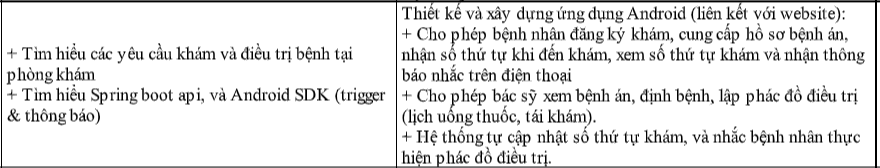
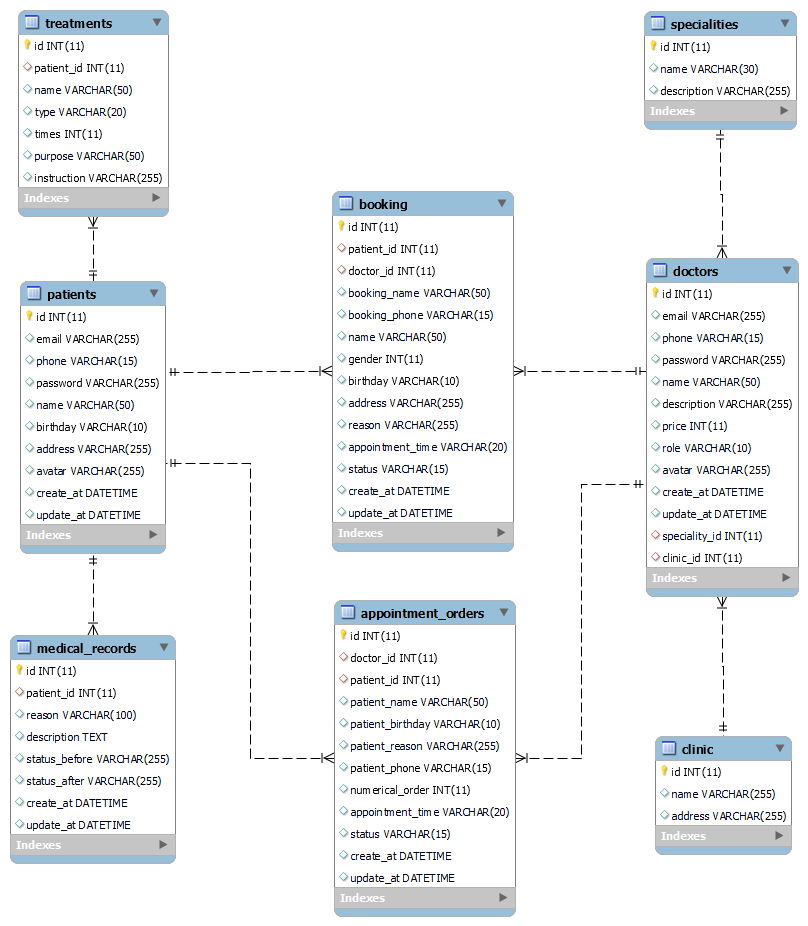
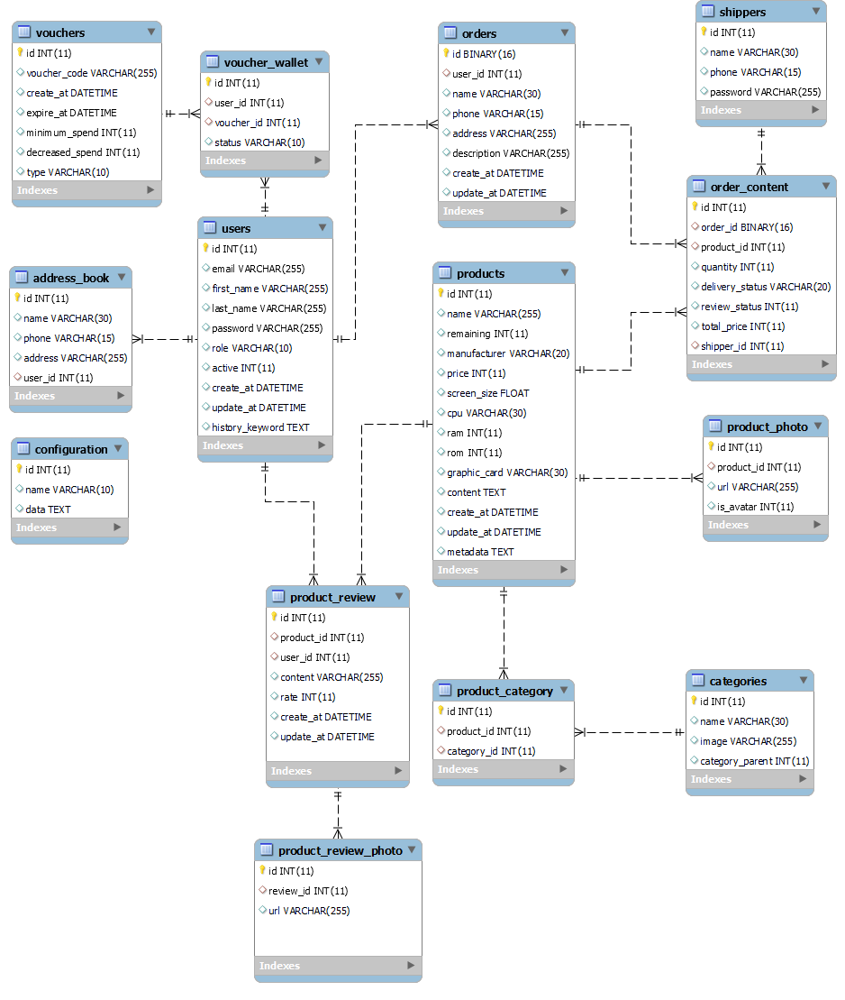

<h1 align="center">Đồ án tốt nghiệp - Học viện Công nghệ Bưu chính viễn thông  
    Ứng dụng Android hỗ trợ bệnh nhân đăng ký khám và điều trị bệnh 
</h1>

    

# [**Table Of Content**](#table-of-content)
- [**Table Of Content**](#table-of-content)
- [**Introduction**](#introduction)
- [**Topic**](#topic)
- [**Database**](#database)
- [**Post Script**](#post-script)
- [**Bonus**](#bonus)
- [**Timeline**](#timeline)
  - [**Phase 0: 01-09-2022 to 28-09-2022**](#phase-0-01-09-2022-to-28-09-2022)
  - [**Phase 1: 19-09-2022 to xx-xx-2022**](#phase-1-19-09-2022-to-xx-xx-2022)
- [**Special Thanks**](#special-thanks)
- [**Made with 💘 and PHP **](#made-with--and-php-)

# [**Introduction**](#introduction)

Chào các bạn, mình tên là Nguyễn Thành Phong. Mã số N18DCCN147. Niên khóa 2018-2023. Lời đầu tiên mình xin chào các bạn và cảm ơn tất cả các bạn đang ở đây. Trong tài liệu này mình sẽ chia sẻ tất cả những gì các bạn cần biết khi làm đồ án 
tốt nghiệp và đề tài do mình thực hiện để các bạn có thể tham khảo. Mình hi vọng phần tài liệu mình viết tiếp theo đây 
sẽ hỗ trợ phần nào cho các bạn khi bước tới ngưỡng cửa quan trọng của cuộc đời mình - tốt nghiệp đại học.

# [**Topic**](#topic)

    

# [**Database**](#database)

    

<h3 align="center">

***Sơ đồ cơ sở dữ liệu***
</h3>

# [**Post Script**](#post-script)

**05-10-2022**

Mình không muốn miệt thị chính mái trường mình đã theo học nhưng thực sự là nhiều cái nó như lìn 😋😋. 
Các bạn cứ đọc tấm ảnh phía dưới là sẽ hiểu.

    

<h3 align="center">

***Minh chứng cho sự hãm lìn của trường PTIT***
</h3>

Ban đầu mình không định học làm đồ án tốt nghiệp vì đơn giản là làm đồ án thì khó, mệt và rất áp lực. Học thay thế thì nhẹ nhàng hơn.
Quan trọng hơn cả là kết quả cuối cùng thì mình sẽ vẫn ra trường và xếp loại tốt nghiệp không bị thay đổi. Tức là nếu bạn đạt học lực GIỎI
thì dù bạn học thay thế để ra trường thì nó vẫn là bằng GIỎI.

Vậy mà đùng một cái, nhà trường **từ chối hết tất cả đơn xin chuyển từ đồ án sang học thay thế** 🙂🙂🙂 ( cái dm trường, thế thì ngay từ đầu nói vậy đi cho rồi. Để sinh viên nộp 
đơn cho sướng vào rồi cuối cùng vẫn bắt sinh viên làm đồ án tốt nghiệp). Thực sự là mình cay không thể tả nổi.

Mình đã đánh đổi bằng việc kết thúc sớm chương trình thực tập tại GeoComply ngày 03/10/2022 để đánh đổi bằng việc học thay thế cho khỏe thân.
 Ai dè giờ vẫn phải làm đồ án tốt nghiệp. Chán thực sự chán 😣😣

# [**Bonus**](#bonus)

Dưới đây là cơ sở dữ liệu mà mình phát triển lên từ Đồ án thực tập. Cơ sở dữ liệu này mình thiết kế từ trước phải làm đề tài.
Sau đó thì thay đổi suy nghĩ để chuyển qua làm học thay thế tốt nghiệp.

    

<h3 align="center">

# [**Timeline**](#timeline)

## [**Phase 0: 01-09-2022 to 28-09-2022**](#phase-0-01-09-2022-to-28-09-2022)

- **04-09-2022**: Thi vấn đáp với giáo viên hướng dẫn về đồ án thực tập

- **09-09-2022**: Thi vấn đáp với giáo viên phản biện về đồ án thực tập 

- Thời gian còn lại: đi làm và xả hơi sau thời gian dài làm đồ án thực tập căng thẳng.

## [**Phase 1: 19-09-2022 to xx-xx-2022**](#phase-1-xx-xx-2022-to-xx-xx-2022)

- Thiết kế cơ sở dữ liệu với nhiều bảng nhằm triển khai các chức năng phức tạp hơn

- **04-10-2022**: Thiết kế cơ sở dữ liệu 

- **05-10-2022**: Tối ưu cơ sở dữ liệu và tìm hiểu kĩ các trường hợp đặc biệt của đề tài.

# [**Special Thanks**](#special-thanks)

<table>
        <tr>
            <td align="center">
                <a href="https://github.com/Phong-Kaster">
                    
                     
                    <b>Phong Kaster</b>
                </a>
            </td>
        </tr>
</table>
 
# [**Made with 💘 and PHP **](#made-with-love-and-php)