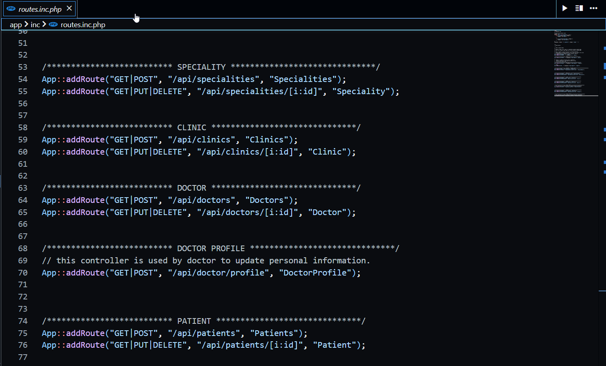
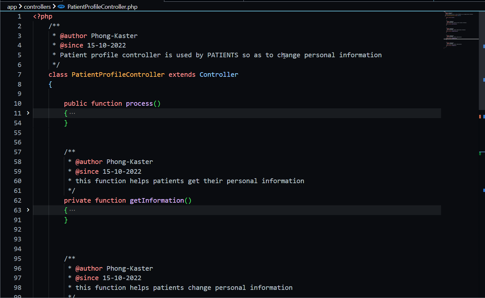
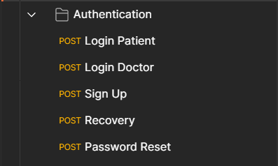
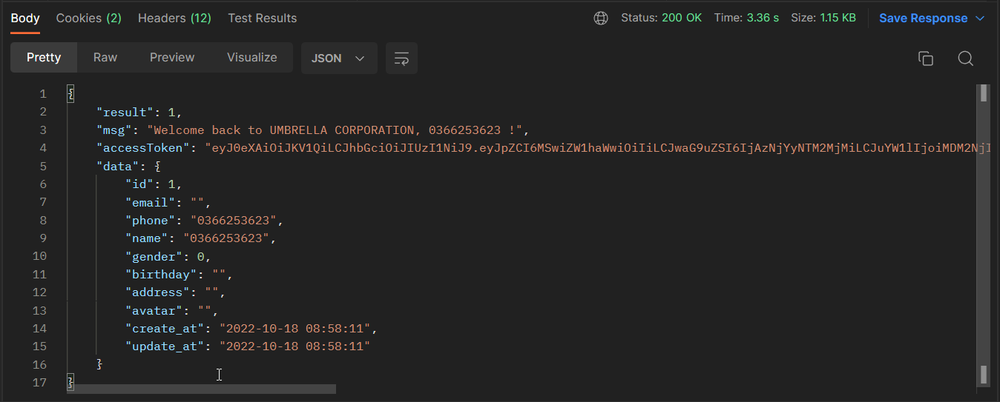
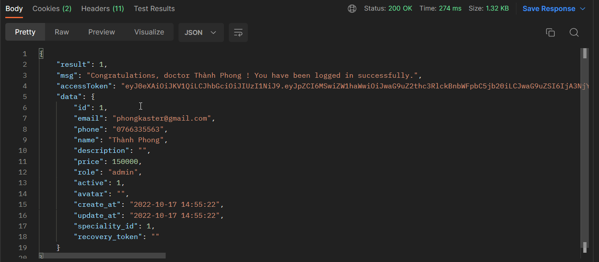
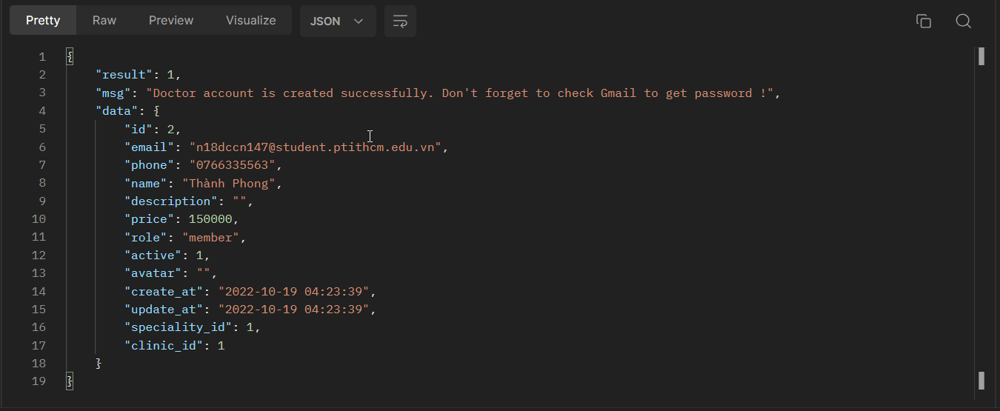
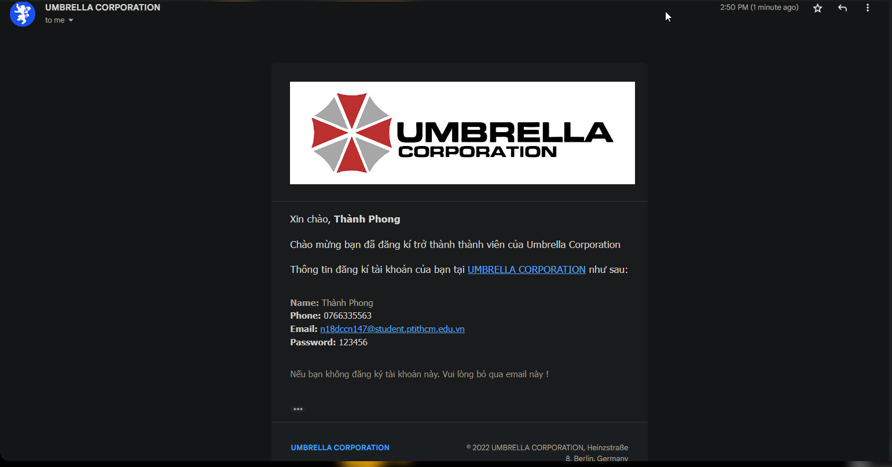
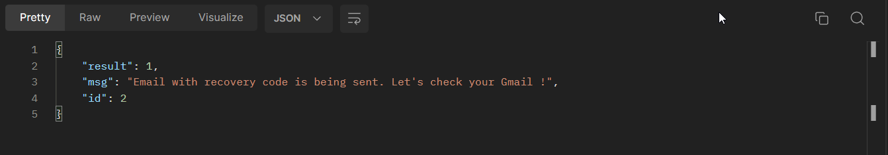
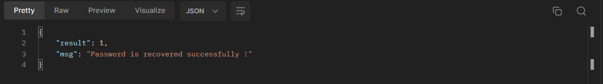

<h1 align="center">Đồ án tốt nghiệp - Học viện Công nghệ Bưu chính viễn thông  
    Tài liệu mô tả API của Ứng dụng Android hỗ trợ bệnh nhân đăng ký khám và điều trị bệnh 
</h1>

    

# [**Table Of Content**](#table-of-content)
- [**Table Of Content**](#table-of-content)
- [**Introduction**](#introduction)
- [**Rules**](#rules)
  - [**1. Method**](#1-method)
  - [**2. Direction**](#2-direction)
  - [**3. Code**](#3-code)
- [**Document**](#document)
  - [**1. Authentication**](#1-authentication)
    - [**0. Pattern**](#0-pattern)
    - [**Login Patient**](#login-patient)
    - [**Login Doctor**](#login-doctor)
    - [**Sign Up**](#sign-up)
    - [**Recovery**](#recovery)
    - [**Password Reset**](#password-reset)
  - [**2. Patients**](#2-patients)
    - [**Read All**](#read-all)
    - [**Read By ID**](#read-by-id)
    - [**Update**](#update)
    - [**Delete**](#delete)
  - [**3. Patient Profile**](#3-patient-profile)
    - [**Read Personal Information**](#read-personal-information)
    - [**Change Personal Information**](#change-personal-information)
    - [**Change Avatar**](#change-avatar)
    - [**Change Password**](#change-password)

# [**Introduction**](#introduction)

Đây là tài liệu mô tả chi tiết từng API được mình - Nguyễn Thành Phong - viết và chuẩn bị trong đồ án.
Mình làm cái này để lưu lại cho mục đích liệt kê các chức năng mình đã làm. Đồng thời, đây là đồ án 
tốt nghiệp của mình nên mình muốn hoàn thiện ở mức đồ tốt nhất có thể.

# [**Rules**](#Rules)

Để dễ đọc & nhanh chóng hiểu cách dùng API này mình sẽ viết theo thứ tự 
[**Controller Timeline**](https://github.com/Phong-Kaster/PTIT-Do-An-Tot-Nghiep#controller-timeline) 
ở bên tài liệu [**Đồ án thực tập**](https://github.com/Phong-Kaster/PTIT-Do-An-Tot-Nghiep)

## [**1. Method**](#1-method)

API của mình viết theo chuẩn Restful API, trong đồ án của mình thì mình chỉ sử dụng 5 dạng phương thức quen thuộc 
sau để xây dựng đồ án:

- 🟢 **GET** - Để truy xuất một tài nguyên. Ví dụ: lấy thông tin 1 giao dịch thì dùng phương thức GET

- 🟡 **POST** - Để tạo một tài nguyên trên máy chủ. Ví dụ: tạo mới một tài khoản

- 🔵 **PUT** - Để thay đổi trạng thái toàn bộ một tài nguyên hoặc để cập nhật nó. Ví dụ: thay đổi mật khẩu, tên hiển thị

- 🟠 **PATCH** - Giống PUT nhưng PATCH thường dùng trong trường hợp sửa 1 phần của tài nguyên.

- 🔴 **DELETE** - Để huỷ bỏ hoặc xoá một tài nguyên. Ví dụ: xóa hoàn toàn một thể loại, bài viết,...

Hãy để ý một chút tới màu sắc mà mình quy ước bên trên. Mình sẽ sử dụng màu sắc kết hợp với các thông tin khác
để mô tả API.

## [**2. Direction**](#2-direction)

Để xem toàn bộ các điều hướng khi một API được gọi. Hãy mở `app/int/routes.inc.php` - đây là tệp tin chứa 
điều hướng & xử lý khi một API được gọi.

    

<h3 align="center">

***Hình ảnh các API được khai báo trong tệp tin routes.inc.php***
</h3>

Giả sử, mình lấy ví dụ một dòng cho dễ hiểu nha 😅

> App::addRoute( "GET|POST", "/api/doctors", "Doctors");

Trong này, cấu trúc mặc định câu lệnh là 

> App::addRoute( "các phương thức hỗ trợ", "tên đường dẫn", "Controller sẽ xử lý yêu cầu");

Vậy thì với ví dụ trên thì 

- `GET|POST` là các phương thức hỗ trợ

- `/api/doctors` là tên đường dẫn của API. Ví dụ như: GET - http://192.168.1.221:8080/PTIT-Do-An-Tot-Nghiep/api/doctors sẽ là một yêu cầu hợp lệ

- `Doctors` là controller xử lý yêu cầu này.

## [**3. Code**](#3-code)

Các mình viết hàm xử lý là đồng nhất và xuyên suốt toàn bộ các controller nên mình sẽ mô tả tóm gọn 
như sau:

    

<h3 align="center">

***Cấu trúc mặc định của một Controller***
</h3>
Từ hình minh họa bên trên, chúng ta có thể hiểu được cấu trúc một Controller trong đồ án này. 

Hàm `process` đóng vai trò như một Contructor của Controller này. Mọi yêu cầu khi được gọi tới 
`Patient Profile Controller` thì hàm `process` này luôn luôn chạy đầu tiên.

Nhờ vào quy ước đặc biệt này, chúng ta sẽ tiến hành điều hướng tới các hàm xử lý bên dưới.

    

<h3 align="center">

***Dòng 34 lấy ra giá trị Action - giá trị này dùng để gọi tới hàm xử lý tương ứng bên dưới***
</h3>

Rất đơn giản phải không ?😎😋. Để lấy tên phương thức được gọi tới chúng ta dùng
hàm `Input::method()`. Nếu muốn lấy giá trị được gửi lên API này. 
Trong hình dòng 34, muốn lấy giá trị **action** thì ta gọi 

> Input::post("action")

Trong đó: 

- **Input** là tên của class chứa phương thức 

- **post** là tên phương thức POST được gọi tới 

- **action** là key của giá trị được gửi lên 

Ví dụ: nếu bạn gửi một biến với key là password lên server với phương thức PUT 
thì câu lệnh để lấy được giá trị sẽ là 

> $password = Input::put("password")

# [**Document**](#document)

Phần này mình sẽ mô tả chi tiết từng API, header cần có những gì, đối số truyền vào là gì và kết quả trả về.

Trong API mình có sử dụng chức năng Variable của POSTMAN để tiết kiệm thời gian viết code. Tên & ý nghĩa của chúng như sau:

| Tên                   | Chức năng                                                                         |
|-----------------------|-----------------------------------------------------------------------------------|
| ENDPOINT_URL          | Tên đường dẫn chung của đồ án - http://192.168.1.221:8080/PTIT-Do-An-Tot-Nghiep   |
| ACCESS_TOKEN          | JWT token của bác sĩ với vai trò ADMIN                                            |
| ACCESS_TOKEN_MEMBER   | JWT token của bác sĩ với vai trò MEMBER                                           |
| ACCESS_TOKEN_SUPPORTER| JWT token của bác sĩ với vai trò SUPPORTER                                        |
| ACCESS_TOKEN_PATIENT  | JWT token của bệnh nhân                                                           |

## [**1. Authentication**](#1-authentication)

Mục đích chung là phục vụ chức năng đăng nhập & xác thực danh tính người dùng.

    

<h3 align="center">

***Các API trong mục Authentication***

### [**0. Pattern**](#0-pattern)

- **Purpose**: 

- **Method**: 

- **URL**: 

- **Headers**: 

- **Body**:
  
  1. 

- **Respone**:

    

<h3 align="center">

### [**Login Patient**](#11-login-patient)

- **Purpose**: Xử lý yêu cầu đăng nhập của bệnh nhân từ Android gửi tới.

- **Method**: 🟡POST

- **URL**: {{ENDPOINT_URL}}/api/login

- **Headers**: bỏ trống

- **Body**:
  
    | Tên                   | Tùy chọn | Ý nghĩa                                                                           |
    |-----------------------|----------|-----------------------------------------------------------------------------------|
    | Type                  | Bắt buộc | chỉ đích danh đối tưởng đang đăng nhập là Bệnh nhân. Điều này giúp phân biệt với yêu cầu đăng nhập từ bác sĩ. Nếu `type = null` thì yêu cầu đăng nhập là từ bác sĩ.                                                          |
    | Email                 | Bắt buộc | Email đăng ký tài khoản                                                            |
    | Password              | Bắt buộc | Mật khẩu tài khoản                                                                 |

- **Respone**:

    

<h3 align="center">

### [**Login Doctor**](#12-login-doctor)

- **Purpose**: Xử lý yêu cầu đăng nhập của bác sĩ 

- **Method**: 🟡 POST

- **URL**: {{ENDPOINT_URL}}/api/login

- **Headers**: bỏ trống

- **Body**:
  
    | Tên                   | Tùy chọn | Ý nghĩa                                                                           |
    |-----------------------|----------|-----------------------------------------------------------------------------------|
    | Type                  | Bắt buộc | chỉ đích danh đối tưởng đang đăng nhập là Bệnh nhân. Điều này giúp phân biệt với yêu cầu đăng nhập từ bác sĩ. Nếu `type = null` thì yêu cầu đăng nhập là từ bác sĩ.                                                          |
    | Email                 | Bắt buộc | Email đăng ký tài khoản                                                            |
    | Password              | Bắt buộc | Mật khẩu tài khoản                                                                 |

- **Respone**:

    

<h3 align="center">

### [**Sign Up**](#13-sign-up)

- **Purpose**: đăng ký tài khoản mới

- **Method**: 🟡 POST

- **URL**: {{ENDPOINT_URL}}/api/signup

- **Headers**: 

    | Tên                  | Giá Trị                                                                   |
    |----------------------|---------------------------------------------------------------------------|
    |Content-Type          | application/x-www-form-urlencoded                                         |

- **Body**:
  
    | Tên                   | Tùy chọn | Ý nghĩa                                                                           |
    |-----------------------|----------|-----------------------------------------------------------------------------------|
    | Email                 | Bắt buộc | Email đăng ký tài khoản                                                           |
    | Phone                 | Bắt buộc | Số điện thoại liên lạc                                                            |
    | Password              | Bắt buộc | Mật khẩu tài khoản        |
    | Password-confirm      | Bắt buộc | Mật khẩu xác nhận         |
    | Name                  | Bắt buộc | Họ tên đầy đủ của bác sĩ  |
    | Description           | Tùy chọn | Mô tả về quá trình công tác  |
    | Price                 | Tùy chọn | Chi phí đặt lịch khám bệnh  |
    | Role                  | Tùy chọn | Quyền truy cập của bác sĩ này. Có 3 quyền chính: admin, member & supporter  |
    | Avatar                | Tùy chọn | Ảnh đại diện  |

- **Respone**:
  

    

- **Email**:

    

### [**Recovery**](#14-recovery)

- **Purpose**: Gửi email để lấy mã xác thực nhằm khôi phục mật khẩu

- **Method**: 🟡 POST

- **URL**: {{ENDPOINT_URL}}/api/recovery

- **Headers**: 

    | Tên                  | Giá Trị                                                                   |
    |----------------------|---------------------------------------------------------------------------|
    |Content-Type          | application/x-www-form-urlencoded                                         |

- **Body**:
  
    | Tên                   | Tùy chọn | Ý nghĩa                                                                           |
    |-----------------------|----------|-----------------------------------------------------------------------------------|
    | Email                 | Bắt buộc | Email đăng ký tài khoản                                                           |

- **Respone**:

    

### [**Password Reset**](#15-password-reset)

- **Purpose**: Đặt lại mật khẩu mới với mã xác thực nhận từ Email

- **Method**: 🟡 POST

- **URL**: {{ENDPOINT_URL}}/api/password-reset/12

> 12 là ID của tài khoản

- **Headers**: 

    | Tên                  | Giá Trị                                                                   |
    |----------------------|---------------------------------------------------------------------------|
    |Content-Type          | application/x-www-form-urlencoded                                         |

- **Body**:
  
    | Tên                   | Tùy chọn | Ý nghĩa                                                                           |
    |-----------------------|----------|-----------------------------------------------------------------------------------|
    | Recovery Token        | Bắt buộc | Mã xác thực để đặt lại mật khẩu                                          |
    | Password              | Bắt buộc | Mật khẩu mới                                                             |
    | PasswordConfirm        | Bắt buộc | Mật khẩu xác thực lại                                                   |

- **Respone**:

    

## [**2. Patients**](#2-patients)
### [**Read All**](#21-read-all)
### [**Read By ID**](#22-read-all)
### [**Update**](#23-read-all)
### [**Delete**](#24-read-all)

## [**3. Patient Profile**](#3-patient-profile)
### [**Read Personal Information**](#31-read-personal-information)
### [**Change Personal Information**](#32-change-personal-information)
### [**Change Avatar**](#33-change-avatar)
### [**Change Password**](#34-change-password)